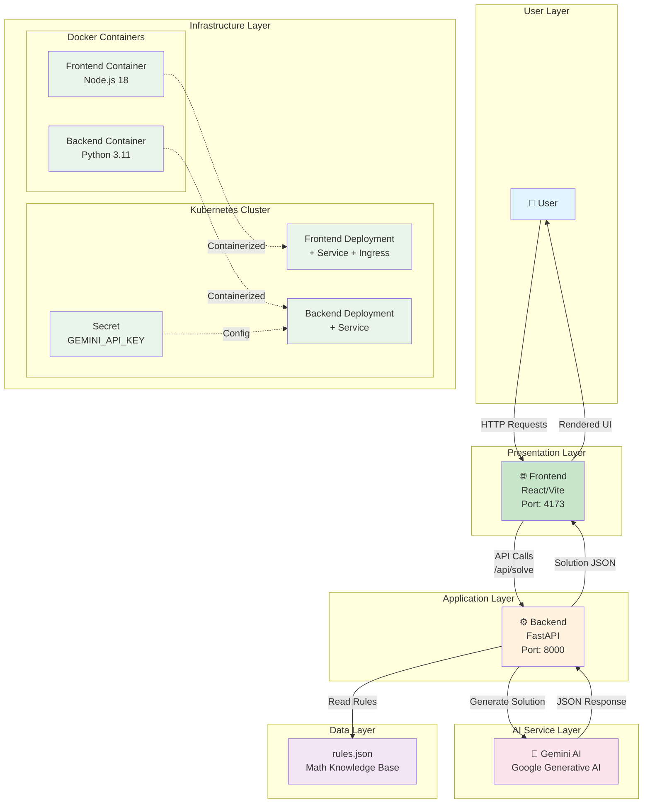

```mermaid
graph TB
    subgraph "User Layer"
        U[👤 User]
    end

    subgraph "Presentation Layer"
        FE[🌐 Frontend<br/>React/Vite<br/>Port: 4173]
    end

    subgraph "Application Layer"
        BE[⚙️ Backend<br/>FastAPI<br/>Port: 8000]
    end

    subgraph "AI Service Layer"
        AI[🤖 Gemini AI<br/>Google Generative AI]
    end

    subgraph "Data Layer"
        R[rules.json<br/>Math Knowledge Base]
    end

    subgraph "Infrastructure Layer"
        subgraph "Docker Containers"
            FED[Frontend Container<br/>Node.js 18]
            BED[Backend Container<br/>Python 3.11]
        end

        subgraph "Kubernetes Cluster"
            KFE[Frontend Deployment<br/>+ Service + Ingress]
            KBE[Backend Deployment<br/>+ Service]
            KS[Secret<br/>GEMINI_API_KEY]
        end
    end

    %% Data Flow
    U -->|HTTP Requests| FE
    FE -->|API Calls<br/>/api/solve| BE
    BE -->|Read Rules| R
    BE -->|Generate Solution| AI
    AI -->|JSON Response| BE
    BE -->|Solution JSON| FE
    FE -->|Rendered UI| U

    %% Infrastructure Flow
    FED -.->|Containerized| KFE
    BED -.->|Containerized| KBE
    KS -.->|Config| KBE

    %% Styling
    classDef userClass fill:#e1f5fe
    classDef frontendClass fill:#c8e6c9
    classDef backendClass fill:#fff3e0
    classDef aiClass fill:#fce4ec
    classDef dataClass fill:#f3e5f5
    classDef infraClass fill:#e8f5e8

    class U userClass
    class FE frontendClass
    class BE backendClass
    class AI aiClass
    class R dataClass
    class FED,BED,KFE,KBE,KS infraClass
```